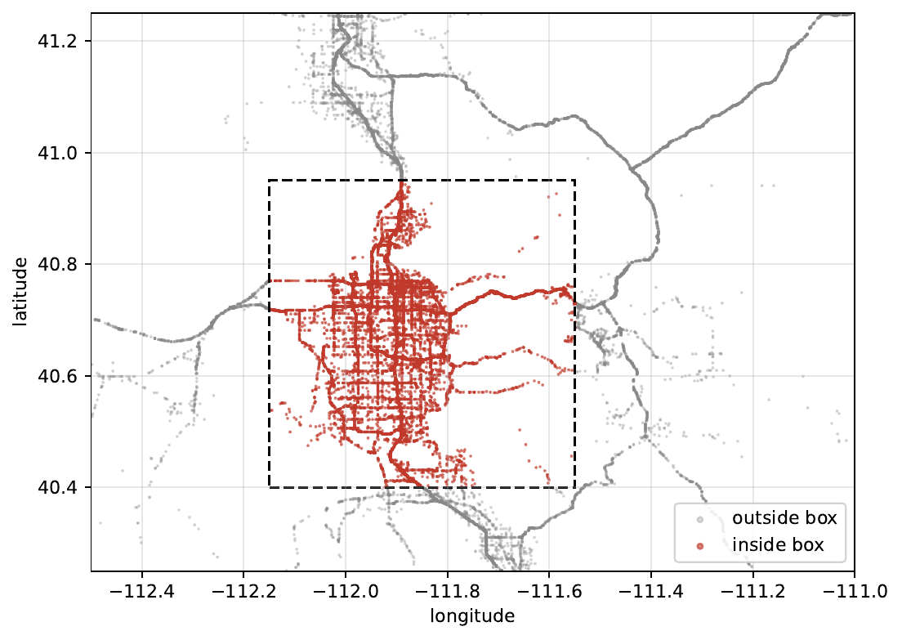
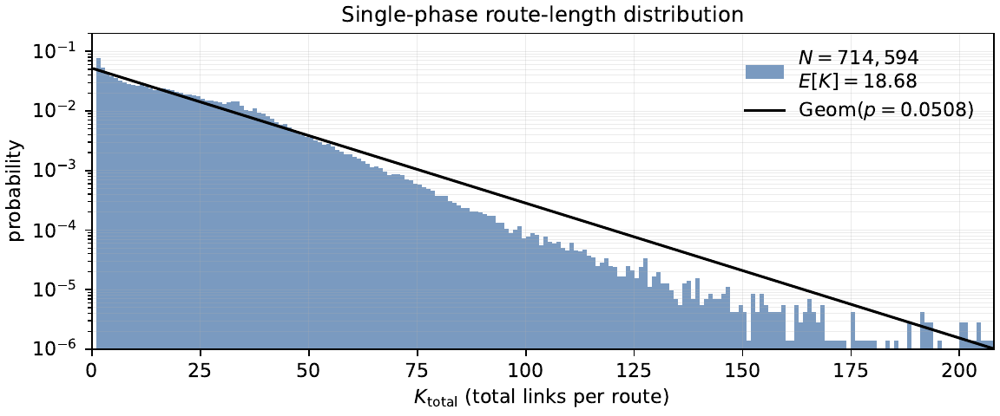
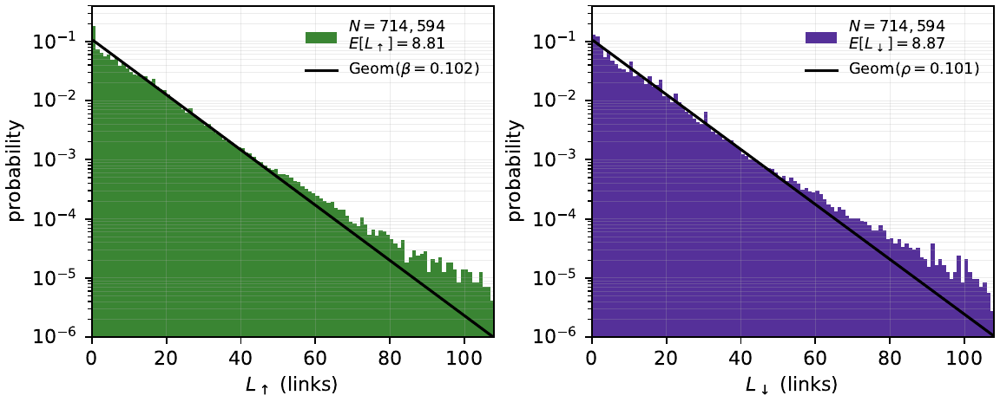

# A Full Metro-scale Time-Dependent Traffic Route Model

Link-level traffic prediction on the Salt Lake City road network from sparse
INRIX probe trajectories. Raw GPS is map-matched to the road graph and
aggregated into time-binned per-link popularity; a two-phase PageRank chain
over a graph-diffused prior then forecasts heavy-traffic links and supports
what-if analysis of road events.



## The data

The input is INRIX probe GPS, which is both sparse and noisy. After cleaning
and map-matching we recover **714,594 trips over 30 days** on a road network of
roughly **99,716 directed links**. Even after aggregating into 5-minute bins
the per-link popularity matrix (**8,640 bins x 60,069 links**) is only
**1.8% non-zero**, and the trip-origin matrix is **0.2% non-zero**: the large
majority of (time, link) cells are never observed. Making this usable took
deliberate work at every stage. Trajectories are cleaned with speed and gap
filters and map-matched with a Newson-Krumm hidden-Markov matcher whose
GPS-noise scale sigma is refit to this corpus by self-consistency
(sigma = 3.5 m, versus 4.07 m on the original Seattle data). Trip starts are
aggregated into a time-binned origin prior, and the heavily-zero popularity
counts are stabilized into a smooth target by a graph diffusion (gamma = 0.20).
These steps are what turn raw, sparse pings into matrices the PageRank chain
can forecast from.

## Pipeline

```
            raw GPS CSVs
                 │
                 ▼   compress_routes.py      clean + segment into trips
         compressed_routes.parquet
                 │
                 ▼   match_routes.py         HMM map-matching (sigma = 3.5 m)
            matched_routes.json
                 │
                 ▼   analyze_popularity.py   time-binned per-link counts
           popularity_results.npz
                 │
                 ▼   generate_smoothed.py    graph diffusion (gamma = 0.20)
          diffused popularity prior
                 │
                 ▼   core/pagerank.py        two-phase PageRank chain
           per-link traffic forecast
```

| stage | script | output |
|---|---|---|
| clean + segment trips | `pipeline/compress_routes.py` | `compressed_routes.parquet` |
| map-matching | `pipeline/match_routes.py` | `matched_routes.json` |
| per-link popularity | `pipeline/analyze_popularity.py` | `popularity_results.npz` |
| origin prior | `analysis/build_origins_v2.py` | `origins_results.npz` |
| diffusion smoothing | `pipeline/generate_smoothed.py` | `popularity_results_smoothed_osm_gamma020.npz` |
| forecast chain | `core/pagerank.py` | per-link `v_up + v_down` |

## Route-length distributions

The model rests on how trip lengths distribute over the network. The per-trip total route length is closely geometric, which sets the chain's restart rate; splitting each trip into an up phase and a down phase lets each be matched by its own geometric, which is what the two-phase chain models.



Per-trip total route length K (number of links) on the 714,594-trip matched corpus, with a single `Geom(p = 0.0508)` reference; the empirical length distribution is closely geometric.



The two-phase split: up-phase length (left) and down-phase length (right), each closely matched by its own geometric overlay; these fits set the phase rates `beta = 0.102` and `rho = 0.101`.

## Setup

```
python -m venv venv && source venv/bin/activate
pip install -r requirements.txt
```

Python 3.11–3.12. The core model and all experiments need only numpy, scipy,
pandas, and matplotlib; `pyarrow` and `leuvenmapmatching` are required only to
re-run the preprocessing/map-matching stages.

## Reproduce the results

The raw GPS (about 13 GB, access-restricted) is **not** redistributed, so the
first two pipeline stages cannot be re-run here. To make the results fully
reproducible without it, the repository **ships the processed inputs** the
model consumes: the road network and graph, the trip-origin prior, the raw
per-link popularity, and the diffused (gamma = 0.20) popularity. Every script
below reads those shipped files, prints its table to stdout, and writes a JSON
under `results/`.

```bash
# Global forecasting parameters (single-phase and two-phase ladders)
TPPR_LADDER_MODE=both  python analysis/sp_origin_pop_full_ladder.py     # single-phase alpha_s, alpha_l
TPPR_LADDER_MODE=sp_la python analysis/tp_updown_origin_pop_full_ladder.py  # two-phase up/down exponents

# Population measure / diffusion diagnostics
python analysis/justification_full.py        # zero landscape across weeks
python analysis/gamma_zero_cells.py          # zero-cell displacement vs gamma
python analysis/noise_floor_without_zeros.py # cross-week noise floor figure
python analysis/quantify_geometric_fit.py    # geometric goodness-of-fit (KS)

# Event case studies
python analysis/i15_crash_surgeries.py                          # crash: surgery vs no surgery
python analysis/stadium_psi_msemae_allhours.py                  # stadium: learned prior transfer psi
TPPR_MODE=gamma_surg2 python analysis/festival_psi_msemae_surg.py  # festival: surgery + psi, 5-fold CV
```

Most scripts accept environment overrides (for example `TPPR_LADDER_MODE`
selects which exponents are free; `TPPR_MODE` selects the festival surgery
variant; `TPPR_HOURS` restricts the festival evaluation window). Defaults
reproduce the paper configuration.

## Learned parameters

| parameter | meaning | learned by |
|---|---|---|
| `alpha_s`, `alpha_l` | single-phase speed / lane exponents | `analysis/sp_origin_pop_full_ladder.py` |
| `alpha_s^up/dn`, `alpha_l^up/dn` | two-phase up/down speed / lane exponents | `analysis/tp_updown_origin_pop_full_ladder.py` |
| `beta`, `rho` | phase commit / restart rates | `analysis/compute_phase_split.py` (geometric fit of phase lengths) |
| `gamma = 0.20` | diffusion mixing constant | `pipeline/generate_smoothed.py` |
| `psi` | event prior mass-transfer onto an eval box | the event scripts (stadium / festival) |

## Event case studies

Three Salt Lake City events stress-test the model:

- **I-15 crash** — a lane closure. We cut the closed link from the network,
  re-solve the chain, and compare the eval-box error with and without this
  surgery.
- **Stadium game** — a pure demand surge, no closures. We learn a prior
  mass-transfer `psi` that shifts demand onto the stadium box, fit on a
  held-out split of the box links.
- **9th & 9th street festival** — a road closure plus a demand shift. We
  combine surgery (remove the closed streets) with the learned `psi`, chosen by
  5-fold cross-validation.

## Repository layout

```
pipeline/   raw GPS -> matched -> popularity -> diffused prior
core/       two-phase PageRank chain and IO helpers
analysis/   parameter fitting and the paper experiments
data/       network, graph, origin prior, popularity (raw + diffused gamma=0.20)
docs/       figures for this README
config.py   shared paths and defaults
```
